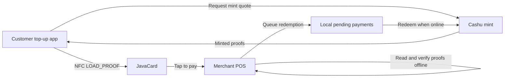

# NFC Payment Flow

This document explains the user-facing payment flow for `cashu-javacard`: what the card does, how value is loaded, how a merchant receives a payment, and what happens after the tap.

## What cashu-javacard is

`cashu-javacard` is a JavaCard applet for offline Cashu payments over NFC. A compatible JavaCard stores Cashu proofs in secure card memory. When the card is tapped at a merchant terminal, the terminal can read selected proofs and verify them locally, even if the point-of-sale device is temporarily offline.

The card acts like a bearer instrument: whoever controls the physical card can spend the proofs loaded onto it. Treat a funded card like cash.

## Actors

- **Customer card** — a JavaCard with the Cashu applet installed and funded with Cashu proofs.
- **Customer app / top-up tool** — software that gets proofs from a Cashu mint and writes them to the card.
- **Merchant terminal** — usually Flash POS or another NFC-capable point-of-sale app.
- **Cashu mint** — the service that issues and later redeems Cashu proofs.

## High-level flow



If your Markdown viewer does not render Mermaid diagrams, read the same flow as:

1. The customer app receives spendable Cashu proofs from a mint.
2. The customer app writes those proofs to the JavaCard over NFC.
3. The customer taps the card at the merchant terminal.
4. The merchant terminal reads proofs from the card and verifies mint signatures locally.
5. The terminal marks the payment as pending redemption.
6. When online, the terminal redeems the proofs with the mint.

## Loading a JavaCard

### Prerequisites

- A supported JavaCard. See [card compatibility](#card-compatibility).
- A device with NFC reader/writer support.
- JavaCard tooling for installing CAP files.
- A built `CashuApplet.cap` file.
- A top-up/provisioning app capable of requesting Cashu proofs and sending APDU commands.

### Build the applet

From the project root:

```bash
cd applet
mvn package
```

The exact CAP output path depends on the JavaCard build plugin configuration. Keep the generated CAP file available for installation.

### Install the applet

Use your JavaCard management tool to install the generated CAP file onto the card. The applet AID is:

```text
D2 76 00 00 85 01 02
```

Typical installation steps are:

1. Connect the JavaCard through a USB smart-card reader or supported NFC writer.
2. Authenticate to the card manager/security domain.
3. Load the CAP file.
4. Install and select the Cashu applet AID.
5. Confirm that `GET_PUBKEY` and `GET_BALANCE` return valid responses.

Tooling varies by card vendor. Follow the card issuer's GlobalPlatform/JavaCard loading instructions.

### Load proofs onto the card

After installation, a provisioning app can load proofs with `LOAD_PROOF` APDU commands. At a high level:

1. Request or receive Cashu proofs from a trusted mint.
2. Select the Cashu applet AID.
3. Send one `LOAD_PROOF` APDU for each proof.
4. Call `GET_BALANCE` to confirm the total stored value.
5. Optionally call `GET_PROOF_COUNT` to confirm proof-slot usage.

See [`../spec/APDU.md`](../spec/APDU.md) for exact command formats.

## Tap-to-pay flow

1. The merchant enters the sale amount in the POS.
2. The customer taps the funded JavaCard.
3. The POS selects the Cashu applet AID.
4. The POS calls `GET_BALANCE` and reads enough unspent proofs to cover the amount.
5. The POS verifies each proof against known mint keys.
6. The POS calls `SPEND_PROOF` for the selected proofs.
7. The card marks those proof slots as spent using its hardware-persistent state.
8. The POS records the payment locally and prints or displays confirmation.
9. When the POS has internet access, it redeems the collected proofs with the mint.
10. After redemption succeeds, spent slots can be garbage-collected with `CLEAR_SPENT`.

## Tap-to-receive / top-up flow

A card receives value when a top-up tool writes new proofs to it:

1. The user chooses an amount to load.
2. The top-up tool obtains Cashu proofs from the mint.
3. The user taps the card.
4. The tool selects the Cashu applet and sends `LOAD_PROOF` APDUs.
5. The tool confirms the resulting balance with `GET_BALANCE`.

## Card compatibility

| Card / chip | Status | Notes |
| --- | --- | --- |
| Feitian JavaCard 3.0.4 | Target v1 | Expected low-cost deployment card. Validate memory and crypto support before production use. |
| NXP JCOP4 / SmartMX3 | Target v2 | Higher-assurance option with larger deployments in mind. |
| NXP NTAG 424 DNA | Not supported | Not enough memory/crypto capability for this applet profile. |

Compatibility checklist for additional cards:

- JavaCard 3.0.4 or newer, or equivalent supported API surface.
- Enough EEPROM for multiple Cashu proofs.
- APDU support compatible with ISO 14443-4 Type 4 NFC readers.
- secp256k1-capable crypto support if using card-side key generation/signing.
- Reliable non-resettable or tamper-resistant state for proof spend tracking.

## Operational notes

- Funded cards should be treated like physical cash.
- Merchants should redeem queued proofs as soon as connectivity returns.
- POS apps should show a clear pending/settled state when offline redemption is delayed.
- Test every production card model with the exact reader and POS device that will be used in the field.

## Related docs

- [`../README.md`](../README.md)
- [`ARCHITECTURE.md`](ARCHITECTURE.md)
- [`HARDWARE_DEPLOYMENT.md`](HARDWARE_DEPLOYMENT.md)
- [`../spec/APDU.md`](../spec/APDU.md)
- [`../spec/NUT-XX.md`](../spec/NUT-XX.md)
