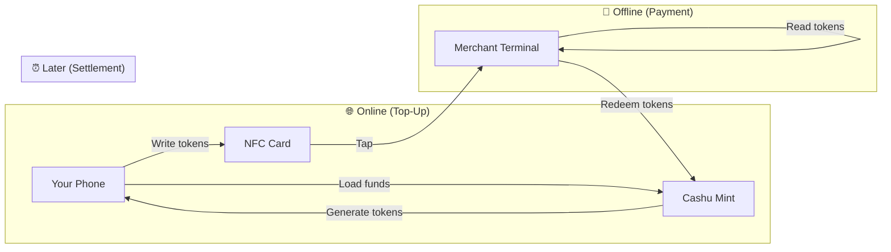
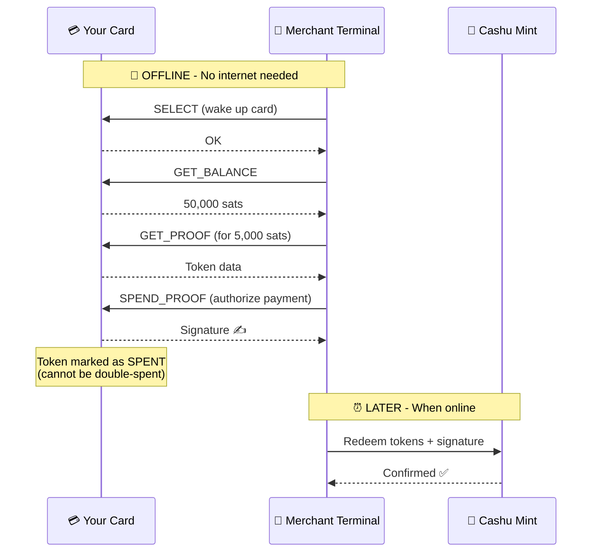

# Cashu NFC Card — User Guide

Welcome! This guide explains how Cashu NFC cards work and how to use them for everyday payments.

## What is a Cashu NFC Card?

A Cashu NFC card is a **physical payment card** that stores digital cash (Cashu ecash tokens) directly on the card itself. Think of it like a prepaid debit card, but:

- ✅ **Works offline** — No internet needed at the moment of payment
- ✅ **Private** — No account, no identity, no tracking
- ✅ **Secure** — Funds are protected by tamper-resistant hardware
- ✅ **Simple** — Just tap to pay

```
┌────────────────────────────────────────┐
│                                        │
│         💳 Your Cashu Card             │
│                                        │
│    ┌──────────────────────────────┐    │
│    │  [NFC Chip]                  │    │
│    │                              │    │
│    │  Balance: 50,000 sats        │    │
│    │  (stored directly on chip)   │    │
│    └──────────────────────────────┘    │
│                                        │
└────────────────────────────────────────┘
```

## How It Works

### The Big Picture



1. **Top-Up (Online)**: Use your phone to load funds onto the card
2. **Pay (Offline)**: Tap the card at any compatible terminal
3. **Settle (Later)**: The merchant redeems the tokens when they're back online

### Why This Is Special

Traditional card payments require the merchant to be online to verify your payment. With Cashu NFC cards:

- The **tokens themselves are the money** — like digital cash
- The merchant can **verify them instantly** without calling a server
- Settlement happens **later**, when convenient

## Using Your Card

### Checking Your Balance

1. Open the [Flash Wallet](https://github.com/lnflash/flash-mobile) app
2. Tap "Card" → "Check Balance"
3. Hold your card to your phone's NFC reader
4. Your balance appears on screen

### Topping Up (Adding Funds)

1. Open the Flash Wallet app
2. Tap "Card" → "Top Up"
3. Enter the amount you want to add
4. Hold your card to your phone
5. Wait for confirmation ✓

```
┌─────────────────────────────────────┐
│  📱 Flash Wallet                    │
│                                     │
│  ┌─────────────────────────────┐    │
│  │                             │    │
│  │    Top Up Card              │    │
│  │                             │    │
│  │    Amount: 10,000 sats      │    │
│  │                             │    │
│  │    [Hold card to phone]     │    │
│  │           📶                │    │
│  │                             │    │
│  └─────────────────────────────┘    │
│                                     │
│  Current balance: 50,000 sats       │
└─────────────────────────────────────┘
```

### Paying at a Store

1. The merchant shows your total on their terminal
2. **Tap your card** on the terminal's NFC reader
3. Done! The payment is instant.

```
  Customer                    Merchant
     │                           │
     │    "That's 5,000 sats"    │
     │◄──────────────────────────│
     │                           │
     │   [Tap card on reader]    │
     │──────────────────────────►│
     │                           │
     │    ✅ "Payment received"  │
     │◄──────────────────────────│
     │                           │
```

### Receiving Funds to Your Card

Some merchants can also **pay you** via NFC — for refunds or payments:

1. Merchant selects "Send to Card"
2. You tap your card
3. Tokens are written to your card

## NFC Payment Flow Diagram

Here's what happens technically when you tap to pay:



## Security

### What Protects Your Funds?

| Protection | How It Works |
|------------|--------------|
| **Hardware chip** | Private keys never leave the card |
| **Spend protection** | Once spent, tokens can't be "unspent" |
| **PIN (optional)** | Require PIN for loading new funds |
| **No account** | Nothing to hack remotely |

### What If I Lose My Card?

Your card is like cash — if you lose it, someone could spend the funds on it. To minimize risk:

- ✅ Don't keep large amounts on the card
- ✅ Top up small amounts frequently
- ✅ Set a PIN to prevent others from adding fake tokens

### What About Double-Spending?

The card's hardware **permanently marks tokens as spent** the moment you tap. Even if someone copies the card data, the tokens are already spent and the merchant will see this when they redeem.

## Compatible Cards

| Card Model | Status | Approximate Price |
|------------|--------|-------------------|
| Feitian JavaCard 3.0.4 | ✅ Recommended | ~$2/card (bulk) |
| NXP JCOP4 SmartMX3 | ✅ Supported | ~$5/card |
| Generic JavaCard 3.0.1+ | ⚠️ May work | Varies |
| NTAG 424 DNA | ❌ Not compatible | — |

## Troubleshooting

### "Card not detected"

- Make sure NFC is enabled on your phone
- Try holding the card flat against the back of your phone
- Remove phone case if it's thick
- Try different positions — NFC antennas vary by phone

### "Insufficient balance"

- Check your balance first
- Top up your card before paying

### "Card locked"

- Too many wrong PIN attempts locks the card
- Contact the card issuer for help

## Glossary

| Term | Meaning |
|------|---------|
| **Cashu** | An ecash protocol for Bitcoin |
| **Mint** | The server that issues and redeems tokens |
| **Token/Proof** | A piece of digital cash stored on your card |
| **NFC** | Near Field Communication — the tap technology |
| **Sats** | Satoshis — the smallest unit of Bitcoin (1 BTC = 100,000,000 sats) |

## Learn More

- [Cashu Protocol](https://cashu.space) — The ecash standard
- [Flash Wallet](https://github.com/lnflash/flash-mobile) — Mobile app for managing your card
- [Flash POS](https://github.com/lnflash/flash-pos) — Merchant terminal app
- [Technical Spec](../spec/NUT-XX.md) — Full protocol documentation

---

*Questions? Open an issue on [GitHub](https://github.com/lnflash/cashu-javacard/issues).*
