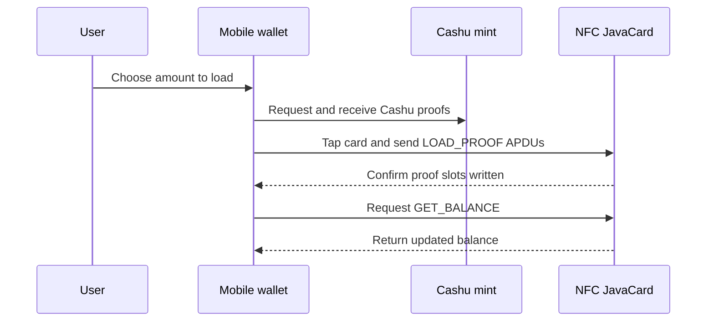
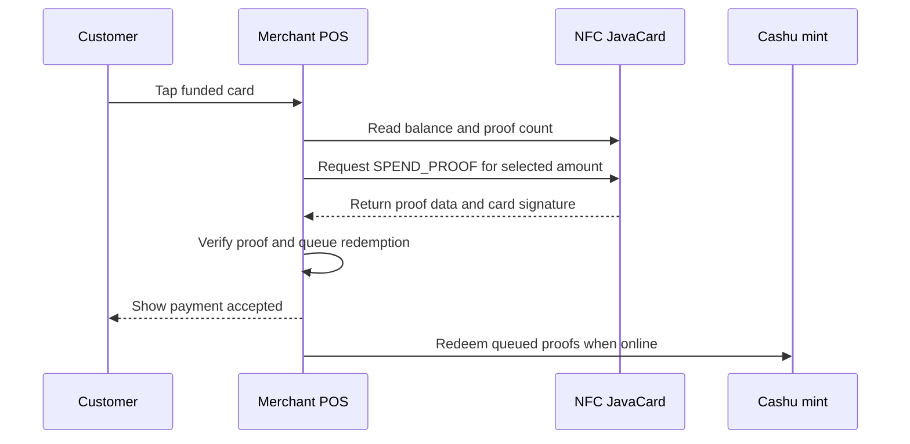

# Cashu JavaCard User Guide

This guide explains what `cashu-javacard` is, how a developer can load it onto a JavaCard, which cards are expected to work, and how the NFC tap flows behave for payments and top-ups.

## What It Is

`cashu-javacard` is a JavaCard applet for offline Cashu bearer payments. A compatible NFC JavaCard stores Cashu proofs in EEPROM and exposes a small APDU command set so a mobile wallet or point-of-sale app can load proofs, read balances, and spend proofs by tapping the card.

The card is designed for the Cashu NFC Card Protocol draft in [`spec/NUT-XX.md`](../spec/NUT-XX.md). It is a bearer-payment profile: whoever holds the card can present the stored proofs, so users should treat a funded card like physical cash.

## Main Components

- JavaCard: stores proof slots, keeps the card keypair on chip, and signs spend operations.
- Cashu mint: issues and later redeems the proofs.
- Mobile wallet or provisioning app: loads proofs onto the card during top-up.
- Merchant POS app: reads spendable proofs from the card during an offline payment and redeems them later when online.

## Card Compatibility

| Card or chip | Expected status | Notes |
| --- | --- | --- |
| Feitian JavaCard 3.0.4 | Primary target | JavaCard 3.0.4 with secp256k1 custom-curve support. |
| NXP JCOP4 SmartMX3 P71 | Secondary target | Same JavaCard API family; verify curve and memory support before production use. |
| Generic JavaCard 3.0.1+ | Experimental | May work if `KeyAgreement.ALG_EC_SVDP_DH_PLAIN_XY` and enough EEPROM are available. |
| NXP NTAG 424 DNA | Not supported | Not enough memory and no required EC crypto support. |
| JavaCard 2.2.x | Not supported | Missing required `int` support and ECDH plain-XY APIs. |

Before ordering cards at volume, load the applet on a small batch and verify `SELECT`, `GET_INFO`, `GET_PUBKEY`, `LOAD_PROOF`, and `SPEND_PROOF` with the intended reader.

## Loading The Applet

The detailed deployment commands live in [`docs/HARDWARE_DEPLOYMENT.md`](HARDWARE_DEPLOYMENT.md). The short path is:

1. Install JDK 11 or newer, Apache Ant 1.10 or newer, GlobalPlatformPro, and PC/SC reader support.
2. Insert a compatible JavaCard into the reader.
3. Build the CAP file from the applet directory:

   ```bash
   cd applet
   ant clean cap
   ```

4. List the card to confirm it is visible:

   ```bash
   gp --list
   ```

5. Install the generated CAP file:

   ```bash
   gp --install target/cashu-javacard-0.1.0.cap
   ```

6. Select the applet and verify it responds:

   ```bash
   gp --apdu 00A4040007D2760000850102
   gp --apdu B0100000
   ```

`GET_PUBKEY` should return a compressed secp256k1 public key followed by status word `9000`.

## Top-Up Flow

Top-up is the online provisioning flow that moves newly minted Cashu proofs onto the card.



The card stores denomination proofs in fixed proof slots. Once loaded, a proof can be spent offline by a merchant reader. The card does not contact the mint directly.

## Tap-To-Pay Flow

Tap-to-pay is the offline merchant flow. The merchant can accept proofs without an internet connection and redeem them later.



The applet marks a proof slot as spent before returning the spend response. This prevents the same card session from reusing that proof through the APDU interface.

## Tap-To-Receive Flow

Receiving funds is the same as top-up from the card's point of view. A wallet or provisioning app gets Cashu proofs from a mint, then writes them to empty proof slots with `LOAD_PROOF`. If the card is full, the app should clear spent slots before loading more proofs.

## Safety Notes

- Treat a loaded card like physical cash.
- Keep test cards separate from production cards.
- Use secure channel keys and vendor key ceremonies for production deployments.
- Delete and reinstalling the applet wipes the card keypair and all proof data.
- Do not depend on NTAG-only cards for this protocol; the applet needs JavaCard compute and EEPROM.

## Troubleshooting

| Symptom | Likely cause | What to check |
| --- | --- | --- |
| `gp --list` shows no reader | PC/SC or reader driver issue | Confirm the reader works with another card and restart the PC/SC service. |
| `SELECT` does not return `9000` | Applet was not installed or wrong AID was used | Re-run `gp --list` and compare the applet AID with [`docs/HARDWARE_DEPLOYMENT.md`](HARDWARE_DEPLOYMENT.md). |
| `GET_PUBKEY` fails | Card lacks required EC support or hardware mode is wrong | Verify JavaCard version and secp256k1 support. |
| `LOAD_PROOF` fails | Bad proof encoding or no empty proof slots | Check APDU format in [`spec/APDU.md`](../spec/APDU.md) and clear spent slots if needed. |
| Payment is accepted offline but later redemption fails | Mint rejects proof or proof was already redeemed | The POS should mark queued redemptions as pending until the mint confirms them online. |
