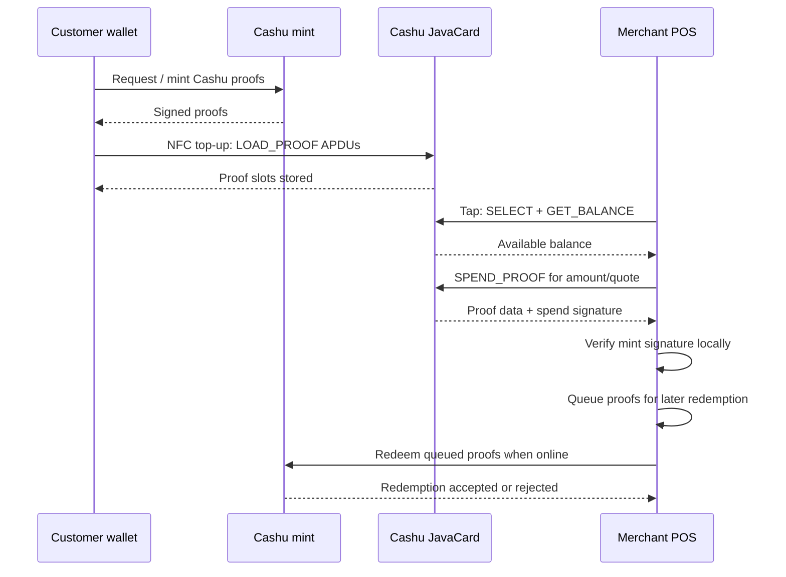

# Cashu JavaCard User Guide

This guide explains what `cashu-javacard` is, how the card is loaded, and how the NFC tap flow works for offline bearer payments.

## What this project is

`cashu-javacard` is a JavaCard applet for storing and spending [Cashu](https://cashu.space/) ecash proofs on an NFC smart card. The card behaves like a physical bearer instrument: once funded, a customer can tap the card at a compatible point-of-sale terminal and transfer proofs without the card needing internet access.

The design targets the Cashu NFC Card Protocol draft in [`spec/NUT-XX.md`](../spec/NUT-XX.md), Profile B: bearer/offline payments.

### Roles

- **Customer mobile wallet**: obtains Cashu proofs from a mint and loads them onto the card.
- **Cashu JavaCard**: stores proofs, tracks which proof slots have been spent, and signs spend requests.
- **Merchant POS**: reads spendable proofs over NFC, verifies them locally, queues redemption, and later redeems them with the mint.
- **Cashu mint**: issues proofs during top-up and later accepts unspent proofs for redemption.

## Supported card hardware

| Card / chip | Status | Notes |
| --- | --- | --- |
| Feitian JavaCard 3.0.4 | Primary target | Low-cost target for v1; requires secp256k1/custom curve support. |
| NXP JCOP4 / SmartMX3 P71 | Planned v2 target | Higher-assurance secure element; same JavaCard 3.0.4 API family. |
| Generic JavaCard 3.0.1+ | Experimental | Must support `KeyAgreement.ALG_EC_SVDP_DH_PLAIN_XY` and enough EEPROM for proof storage. |
| JavaCard 2.2.x | Not supported | Missing required API/runtime features. |
| NXP NTAG 424 DNA | Not supported | Not a JavaCard target and lacks sufficient crypto/storage for this applet. |

See [`HARDWARE_DEPLOYMENT.md`](HARDWARE_DEPLOYMENT.md) for the lower-level deployment checklist and APDU verification commands.

## Tools you need

- JDK 11 or newer
- Apache Ant 1.10+
- GlobalPlatformPro (`gp`) for loading CAP files onto cards
- A PC/SC-compatible smart-card reader, or an NFC reader that exposes the card through PC/SC
- A compatible JavaCard with GlobalPlatform card manager access

macOS install example:

```bash
brew install openjdk@17 ant pcsc-lite
curl -L https://github.com/martinpaljak/GlobalPlatformPro/releases/latest/download/gp.jar \
  -o /usr/local/bin/gp.jar
cat >/usr/local/bin/gp <<'SH'
#!/bin/sh
exec java -jar /usr/local/bin/gp.jar "$@"
SH
chmod +x /usr/local/bin/gp
```

> Production cards should use issuer-specific SCP02/SCP03 keys instead of public/default test keys.

## Build the applet CAP file

```bash
git clone https://github.com/lnflash/cashu-javacard.git
cd cashu-javacard/applet

# Optional: run the simulator tests first
mvn test

# Build the JavaCard CAP file
ant clean cap
```

Expected CAP output:

```text
applet/target/cashu-javacard-0.1.0.cap
```

Before creating a hardware image, make sure the applet is built in hardware mode if the current source exposes that switch:

```java
static final boolean HARDWARE = true;
```

Leave simulator/test builds in software mode when running jCardSim-based unit tests.

## Load the applet onto a JavaCard

1. Insert the JavaCard into the reader.
2. Confirm the card manager is visible:

   ```bash
   gp --list
   ```

3. Install the CAP file:

   ```bash
   cd cashu-javacard/applet
   gp --install target/cashu-javacard-0.1.0.cap
   ```

4. Verify the applet is selectable:

   ```bash
   gp --list
   ```

   You should see the Cashu applet AID as selectable:

   ```text
   APP: D276000085010201 (SELECTABLE)
   ```

5. Select the applet and request basic info:

   ```bash
   gp --apdu 00A4040007D2760000850102
   gp --apdu B0010000
   ```

A successful APDU response ends in `9000`.

## NFC tap payment flow



### Tap to receive / top up

1. The customer wallet obtains Cashu proofs from the configured mint.
2. The wallet asks the user to tap the card.
3. The wallet selects the Cashu applet AID.
4. The wallet sends one or more `LOAD_PROOF` APDUs.
5. The card stores proofs in persistent slots and updates the available balance.

### Tap to pay

1. The merchant enters or scans the amount due in the POS app.
2. The customer taps the card.
3. The POS selects the Cashu applet and reads the balance/proof count.
4. The POS asks the card to spend the necessary proof slots.
5. The card marks those proof slots as spent before returning proof material/signatures.
6. The POS verifies proof signatures locally and queues the proofs.
7. When the POS has internet access, it redeems queued proofs with the mint.

## Operational notes

- Treat a loaded card like cash. Whoever can tap and spend the card can move the bearer proofs.
- A card delete/reinstall wipes the card keypair and stored proofs.
- Merchant POS devices should redeem queued proofs as soon as they are online to reduce double-spend exposure.
- The applet cannot prevent a malicious terminal from requesting a spend; user experience and POS trust boundaries matter.
- Broken or rejected redemptions should be surfaced to the merchant with enough detail to identify stale, already-spent, or malformed proofs.

## Related documentation

- [`../README.md`](../README.md) — project overview and command summary
- [`HARDWARE_DEPLOYMENT.md`](HARDWARE_DEPLOYMENT.md) — deployment/APDU details
- [`ARCHITECTURE.md`](ARCHITECTURE.md) — architecture notes
- [`../spec/APDU.md`](../spec/APDU.md) — APDU command reference
- [`../spec/NUT-XX.md`](../spec/NUT-XX.md) — protocol draft
