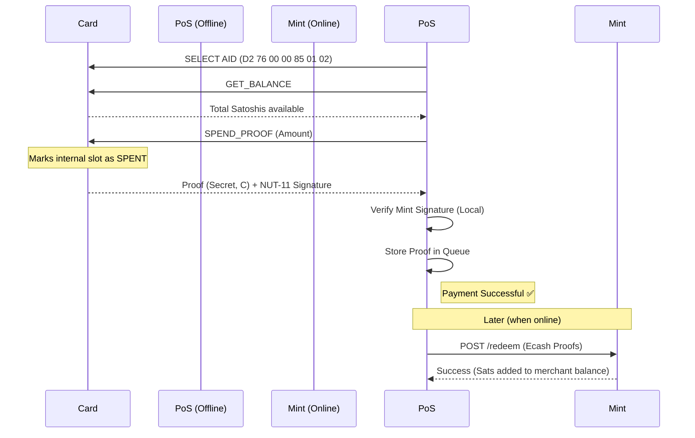

# User Guide: cashu-javacard

Detailed guide on how to set up and use Cashu on a physical JavaCard for offline NFC payments.

## 💿 Hardware Compatibility

To use this applet, you need a JavaCard meeting these requirements:
- **JavaCard Version**: 3.0.4 or higher.
- **Cryptography**: Support for `secp256k1` (specifically `ALG_EC_FP` curves).
- **Interface**: NFC (ISO 14443-4 Type 4).
- **Memory**: At least 16KB of available EEPROM for proof storage.

| Recommended Card | Where to Buy | Notes |
|------------------|--------------|-------|
| Feitian FT-Java/A22 | Feitian Shop | Reference target (v1) |
| NXP JCOP4 P71 | Various | High-security CC EAL 5+ |

## 🛠️ Loading the Applet

You will need a standard CCID smart card reader and [GlobalPlatformPro](https://github.com/martinpaljak/GlobalPlatformPro).

1. **Build the CAP file**:
   ```bash
   cd applet
   ant cap
   ```
   The file will be at `applet/target/cashu-javacard-0.1.0.cap`.

2. **List card info** (verify reader connection):
   ```bash
   gp --info
   ```

3. **Install the applet**:
   ```bash
   gp --install target/cashu-javacard-0.1.0.cap
   ```

## 💸 NFC Payment Flow (NUT-XX)

### 1. Top-up (Online)
Before paying, the card must be loaded with ecash proofs from a Cashu Mint.
1. **Select Applet**: The mobile wallet selects AID `D2760000850102`.
2. **Get PK**: Wallet calls `GET_PUBKEY` to identify the card.
3. **Provision**: Wallet sends Cashu proofs via `LOAD_PROOF` commands.

### 2. Tap-to-Pay (Offline)
The merchant terminal (PoS) does not need internet at the moment of the tap.



## 🛡️ Security Features

- **Hardware Isolation**: The card's private key is generated on-chip during the first boot and never leaves the Secure Element.

## 🔍 Troubleshooting

**Error `6A 82` (File not found)**
The AID is not installed correctly. Run `gp --list` to check if `D2760000850102` is present.

**Error `69 85` (Conditions not satisfied)**
Usually occurs during `LOAD_PROOF` if the card is full or authentication failed. Use `GET_PROOF_COUNT` to check capacity.

**Card not detected via NFC**
Ensure you are using a JavaCard with an antenna (dual-interface). Some "Contact-only" JavaCards look identical but lack NFC coils.