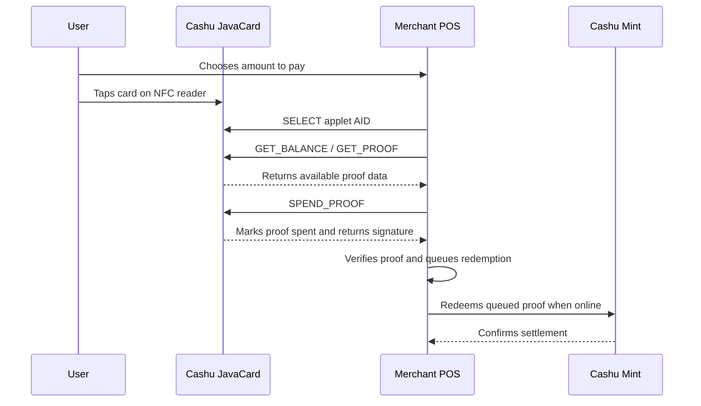

# cashu-javacard User Guide

`cashu-javacard` is a JavaCard applet for offline Cashu bearer payments over NFC.
It lets a payment card hold Cashu proofs and release them to a compatible point
of sale terminal when the user taps the card.

## What It Does

- Stores Cashu proofs on a JavaCard.
- Exposes an NFC APDU interface for balance, proof loading, and spending.
- Uses the card chip for key storage and signing.
- Supports offline merchant reads, with online redemption deferred until the
  merchant terminal reconnects.

This project is for developers and integrators building the card, wallet, or
point-of-sale side of the flow. End users should receive pre-provisioned cards
from an issuer or wallet provider.

## Compatible Cards

| Card family | Status | Notes |
|---|---|---|
| Feitian JavaCard 3.0.4 | Target v1 | Primary low-cost target. Requires JavaCard 3.0.4+ and enough EEPROM for proof storage. |
| NXP JCOP4 / SmartMX3 | Target v2 | Higher-assurance target with stronger secure-element properties. |
| Other JavaCard 3.0.4+ cards with secp256k1 support | Experimental | Should be evaluated against the APDU test suite before production use. |
| NXP NTAG 424 DNA | Not supported | Insufficient memory and no required EC crypto support. |

## JavaCard Loading Flow

The exact tooling depends on the card vendor and secure-channel setup, but the
high-level process is:

1. Install the JavaCard SDK and JDK version required by the target card.
2. Build the applet CAP file from the `applet/` project.
3. Connect a compatible NFC or contact smart-card reader.
4. Open a GlobalPlatform secure channel to the card.
5. Load and install the CAP package with the Cashu applet AID.
6. Select the applet and verify that `GET_PUBKEY` and `GET_BALANCE` return
   successful APDU responses.
7. Provision one or more Cashu proofs with the authenticated `LOAD_PROOF`
   command.

Example command shape with GlobalPlatformPro:

```bash
gp --install applet/cap/CashuApplet.cap
```

Production issuers should use their card vendor's secure-channel keys and
personalization process. Do not reuse test keys for issued cards.

## NFC Tap Payment Flow



## Tap To Receive Flow

Receiving funds is a provisioning operation:

1. A wallet or issuer obtains Cashu proofs from a mint.
2. The wallet connects to the card over NFC.
3. The wallet selects the applet and authenticates the loading session.
4. The wallet calls `LOAD_PROOF` for each proof.
5. The wallet calls `GET_BALANCE` to confirm the card balance.

The card should reject unauthenticated proof loading in production deployments.

## Operational Notes

- Treat each card as a bearer instrument. Whoever controls the card can attempt
  to spend the proofs stored on it.
- The merchant terminal must redeem collected proofs once it is online.
- A spent proof slot should not become spendable again after reset or power loss.
- If a card is lost, only unredeemed value still on the card is at risk.
- Keep the APDU spec in `spec/APDU.md` nearby when implementing wallet or POS
  integrations.

## Related Documents

- [Architecture](ARCHITECTURE.md)
- [Hardware Deployment](HARDWARE_DEPLOYMENT.md)
- [APDU Specification](../spec/APDU.md)
- [NUT-XX Draft](../spec/NUT-XX.md)
