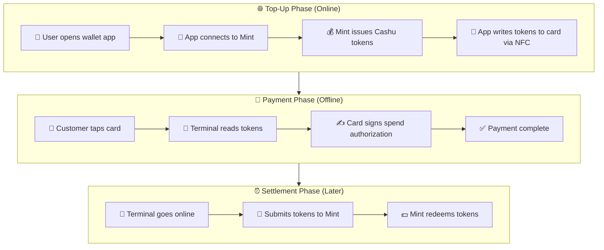
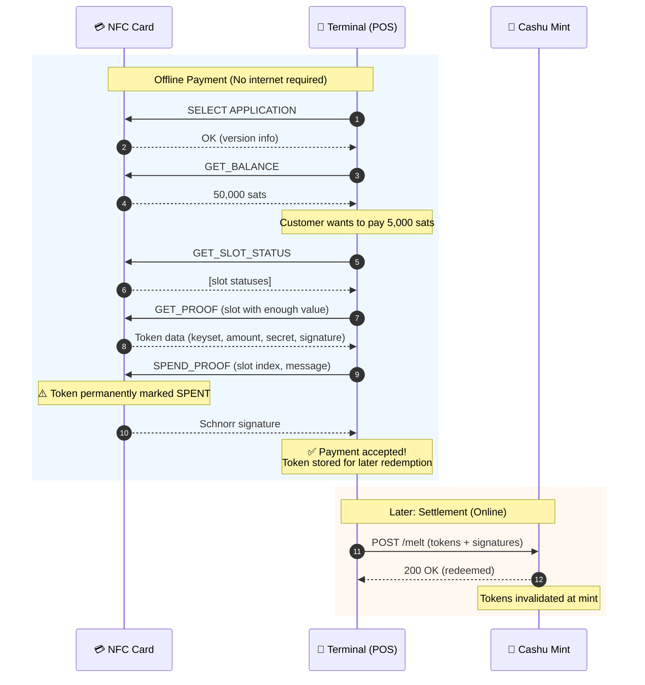
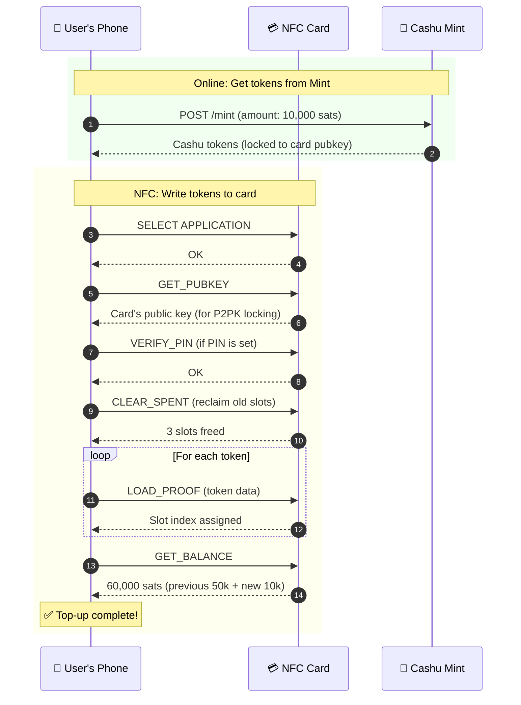
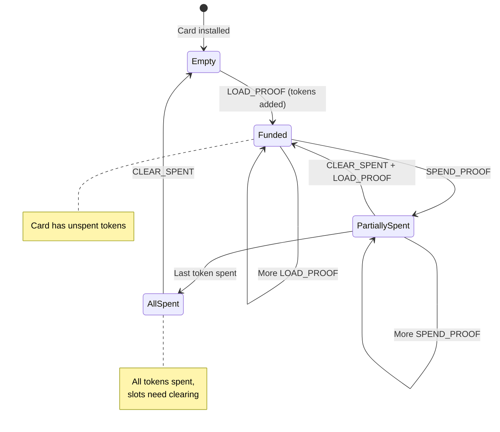
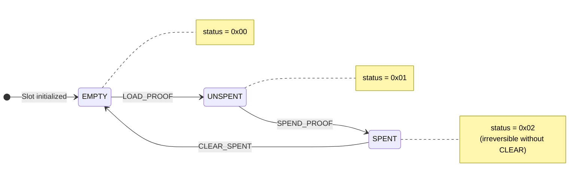

# Payment Flow Diagrams

Visual diagrams of the Cashu NFC card payment flows. These can be rendered by GitHub, VS Code, or any Mermaid-compatible viewer.

## End-to-End Flow



## Detailed Payment Sequence



## Top-Up (Provisioning) Sequence



## Card States



## Proof Slot Lifecycle



---

## Embedding These Diagrams

### In GitHub README/Markdown

GitHub natively renders Mermaid in markdown files. Just paste the code blocks.

### In a Website

```html
<script src="https://cdn.jsdelivr.net/npm/mermaid/dist/mermaid.min.js"></script>
<script>mermaid.initialize({startOnLoad:true});</script>

<div class="mermaid">
  flowchart LR
    A[Card] -->|tap| B[Terminal]
</div>
```

### Export as PNG/SVG

Use the [Mermaid Live Editor](https://mermaid.live/) to export diagrams as images.
